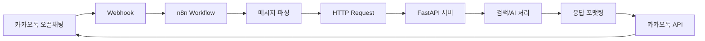
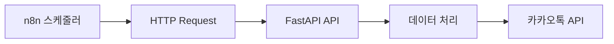
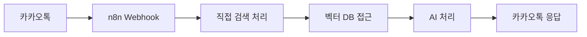

# n8n 카카오톡 챗봇 연동 분석 보고서

## 📋 프로젝트 개요

이 문서는 기존 LOD Wiki 검색 시스템과 n8n을 연동하여 카카오톡 오픈채팅방에서 동작하는 챗봇 구축 방안을 분석한 보고서입니다.

## 🔍 현재 시스템 분석

### 메인 서버 프로그램
- **위치**: `C:\Project\Lod_wiki\main.py`
- **기술스택**: FastAPI 기반 웹 서버
- **포트**: 8001 (기본값, 환경변수로 변경 가능)
- **주요 기능**:
  - API 라우터 통합 관리
  - CORS 설정 (메신저봇R 연동용)
  - 정적 파일 서빙
  - 웹 UI 제공 (검색, 파일 관리, 통계 등)

### 현재 메신저봇 구조

#### 1. 메신저봇R JS 프로그램
**위치**: `C:\Project\Lod_wiki\assets\messenger_bot_r_api2_192_168_0_3_script.js`

**연동 방식**:
```javascript
// org.jsoup.Jsoup을 사용한 HTTP 요청
const response = org.jsoup.Jsoup.connect(url)
    .header("Accept", "application/json")
    .header("Content-Type", "application/json")
    .ignoreHttpErrors(true)
    .ignoreContentType(true)
    .get().text();
```

**주요 명령어**:
- `!검색 [검색어]` - 하이브리드 검색 실행
- `!질문 [질문내용]` - AI 기반 질의응답
- `!확률 [뽑기명]` - 넥슨나우 확률 정보
- `!도움말` - 도움말 표시
- `!통계` - 데이터베이스 통계
- `!연결테스트` - 서버 헬스 체크
- `!캐시클리어` - AI 답변 캐시 초기화

**특징**:
- 5초 쿨다운 시스템
- 사용자별 요청 제한
- 하이브리드 검색 (벡터 + 키워드)
- AI 답변 캐싱

#### 2. FastAPI 서버 API
**위치**: `C:\Project\Lod_wiki\api\messenger_bot_api.py`

**주요 엔드포인트**:
```python
# 검색/질문 처리
GET/POST /api/messenger/search
- 파라미터: q, user_id, room_id, limit, type

# 통계 정보
GET /api/messenger/stats

# 헬스 체크
GET /api/messenger/health

# 캐시 관리
POST /api/messenger/clear-cache

# 사용량 정보 (비밀 기능)
GET /api/messenger/usage
```

**핵심 기능**:
- 하이브리드 검색 (벡터 DB + 키워드)
- 콘텐츠 필터링
- AI 답변 생성 및 캐싱
- 어둠의전설 관련성 검증

## 🤖 n8n 연동 설계 방안

### 방안 1: Webhook 트리거 방식 (권장)



**장점**:
- 기존 API 완전 활용
- 빠른 개발 가능
- 안정성 보장

**구현 단계**:
1. n8n Webhook 노드 생성
2. 카카오톡 Webhook 설정
3. 메시지 파싱 Function 노드
4. HTTP Request 노드로 기존 API 호출
5. 응답 포맷팅 및 카카오톡 전송

### 방안 2: HTTP Request 노드 방식



**용도**: 정기적인 데이터 업데이트, 통계 알림 등

### 방안 3: 메신저봇 대체 방식



**장점**: n8n으로 완전 통합
**단점**: 기존 로직 재구현 필요

## 🔗 활용 가능한 기존 API

### 검색 API
```http
GET /api/messenger/search?q={query}&user_id={user}&room_id={room}&limit=10&type=search
```

**응답 형식**:
```json
{
  "success": true,
  "message": "포맷팅된 검색 결과",
  "data": {
    "query": "필터링된 쿼리",
    "total_results": 5,
    "results": [...],
    "ai_generated": false,
    "processing_time": 1.23
  },
  "timestamp": "2025-01-23T..."
}
```

### 통계 API
```http
GET /api/messenger/stats
```

### 헬스 체크 API
```http
GET /api/messenger/health
```

## 🛠 n8n 워크플로우 구성 요소

### 1. Webhook 노드
- URL: `https://your-n8n.com/webhook/kakao-chat`
- Method: POST
- 카카오톡 메시지 수신

### 2. Function 노드 - 메시지 파싱
```javascript
// 메시지 파싱 로직
const message = $json.message;
const command = message.startsWith('!') ? message.split(' ')[0] : '';
const query = message.substring(command.length).trim();

return {
  command: command,
  query: query,
  user_id: $json.user_id,
  room_id: $json.room_id
};
```

### 3. HTTP Request 노드
```javascript
// FastAPI 호출 설정
const url = 'http://192.168.0.3:8000/api/messenger/search';
const params = {
  q: $json.query,
  user_id: $json.user_id,
  room_id: $json.room_id,
  limit: 10,
  type: $json.command === '!질문' ? 'question' : 'search'
};
```

### 4. Function 노드 - 응답 포맷팅
```javascript
// 카카오톡 전송용 포맷팅
const response = $json;
return {
  text: response.message,
  chat_id: $json.room_id
};
```

### 5. 카카오톡 API 노드
- 카카오톡 비즈니스 API 또는 오픈채팅 Webhook 활용

## 💡 구현 권장사항

### 1. 우선순위별 구현
1. **1단계**: Webhook + 기존 API 활용 (빠른 프로토타입)
2. **2단계**: 에러 핸들링 및 로깅 강화
3. **3단계**: 고도화 기능 추가 (이미지, 파일 등)

### 2. 필요한 추가 설정
- 카카오톡 오픈채팅 Webhook 설정
- n8n 서버 구축 및 도메인 설정
- SSL 인증서 설정 (HTTPS 필수)
- 모니터링 및 로깅 시스템

### 3. 보안 고려사항
- Webhook URL 보안
- API 키 관리
- 사용자 권한 제어
- 메시지 필터링

## 🔧 기술적 고려사항

### 데이터베이스 연동
- **ChromaDB**: 벡터 검색
- **HybridSearch**: 하이브리드 검색 엔진
- **캐싱**: AI 응답 메모리 캐시

### API 제한사항
- 5초 쿨다운 시스템 (기존)
- Google API 사용량 제한
- 콘텐츠 필터링 적용

### 확장성
- 다중 채팅방 지원
- 사용자별 개인화
- 통계 및 분석 기능

## 📈 예상 워크플로우

### 기본 검색 플로우
1. 사용자가 `!검색 퀘스트` 입력
2. n8n Webhook이 메시지 수신
3. 메시지 파싱하여 명령어와 쿼리 분리
4. HTTP Request로 `/api/messenger/search` 호출
5. FastAPI가 하이브리드 검색 실행
6. AI 답변 생성 또는 캐시에서 조회
7. 포맷팅된 결과를 카카오톡으로 전송

### 에러 처리 플로우
1. API 호출 실패 시 재시도 로직
2. 타임아웃 시 기본 응답 전송
3. 에러 로그 기록 및 관리자 알림

## 🎯 결론

기존 FastAPI 서버와 메신저봇R 시스템이 잘 구축되어 있어, n8n을 통한 카카오톡 연동은 **Webhook + 기존 API 활용 방식**이 가장 효율적입니다. 

기존 시스템의 안정성과 기능을 그대로 활용하면서, n8n의 워크플로우 관리 기능을 추가하여 더욱 유연한 챗봇 시스템을 구축할 수 있습니다.